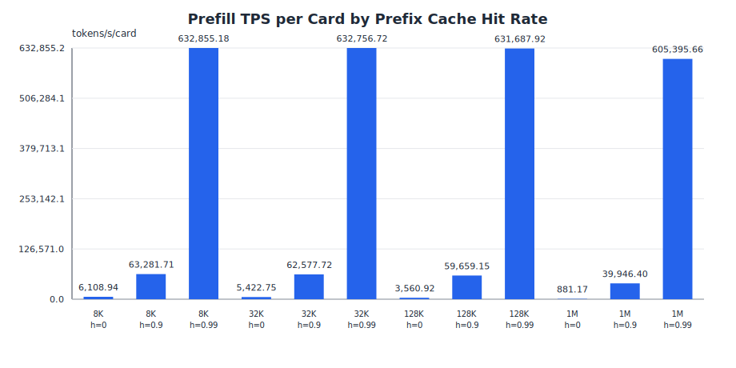
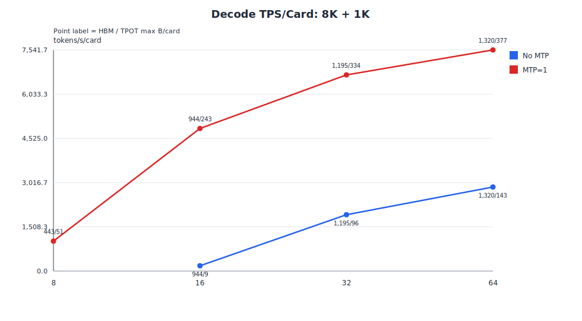
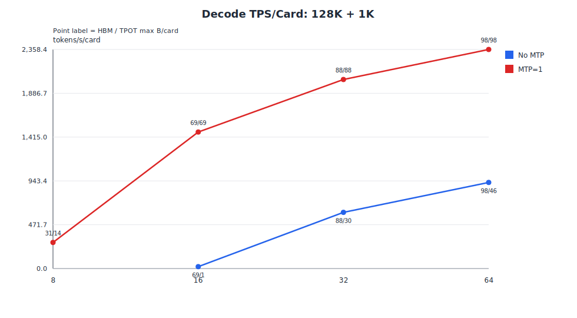
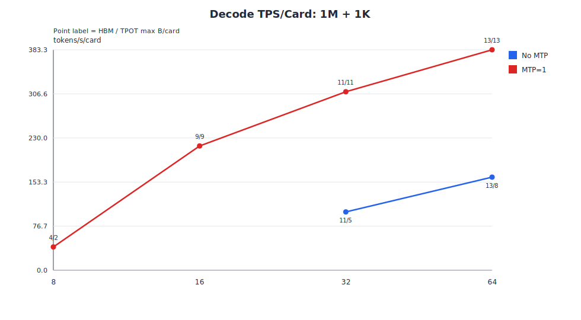
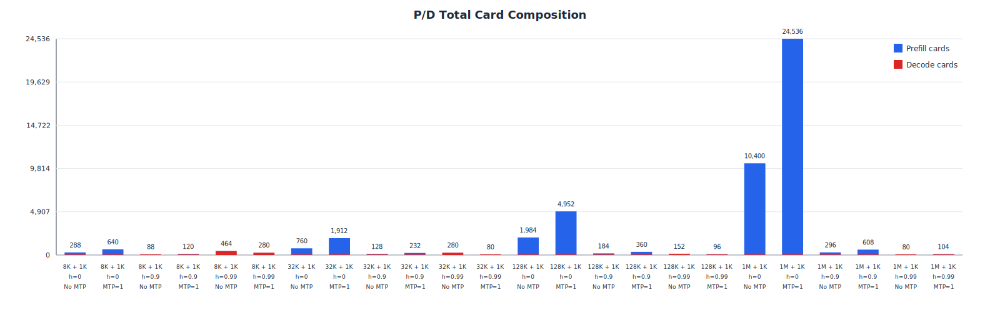

# 0428 PD 分离推理分析报告

## 1. Executive Summary（结论摘要）

本报告基于 DeepSeek V4 Flash W8A8 量化模型在 Ascend 910C 上的 roofline 性能模型（`decode_utilization=0.9`），分析四类 PD 分离推理场景（8K / 32K / 128K / 1M 输入 + 1K 输出）的实例 sizing、Decode 吞吐与 P/D 配比。

核心结论：

- **Prefill**：四个场景最小可行实例均为 **8 卡**，最优策略一致为 `TP=1, EP=8, DP=8`。prefix cache 命中率不改变 HBM sizing，但可使有效计算长度缩短约 100 倍，从而大幅提升 Prefill QPS（h=0 → h=0.9 约 10 倍，h=0.9 → h=0.99 再约 10 倍）。

- **Decode**：所有四个场景在足够卡数下均可满足 TPOT≤50ms，**最优实例统一为 64 卡（TP=1, EP=64, DP=64）**。No MTP 在 8K/32K/128K 下最小需 16 卡，1M 下需 32 卡方可满足 TPOT 约束。MTP=1 在所有卡数下均可行，TPS/card 较 No MTP 高约 2.4–2.7 倍。对 128K 和 1M 场景，MTP=1 的 TPOT 显著低于 50ms（分别为 41.6ms 和 33.9ms），表明该场景为 HBM-bound 而非 TPOT-bound。

- **P/D 配比**：头部推荐（MTP=1）的实例配比随 prefix cache 命中率变化剧烈。`h=0` 时 Prefill 严重不足，需数十至数千个 Prefill 实例配平一个 Decode 实例；`h=0.99` 时 Prefill 极快，配比翻转为 Decode-heavy（8K 和 32K）甚至接近 1:1。

MTP=1 各场景 P/D 推荐配比（`prefix_cache_hit_rate = 0 / 0.9 / 0.99`）：

| 场景 | h=0 | h=0.9 | h=0.99 |
| --- | --- | --- | --- |
| 8K + 1K | 72P:1D，640 卡 | 7P:1D，120 卡 | 3P:4D，280 卡 |
| 32K + 1K | 231P:1D，1,912 卡 | 21P:1D，232 卡 | 2P:1D，80 卡 |
| 128K + 1K | 611P:1D，4,952 卡 | 37P:1D，360 卡 | 4P:1D，96 卡 |
| 1M + 1K | 3,059P:1D，24,536 卡 | 68P:1D，608 卡 | 5P:1D，104 卡 |

---

## 2. 分析目标

对四个 PD 分离推理场景进行：

1. **Prefill 实例 sizing**：确定满足 `bs=1` HBM 约束的最小卡数，以及在该卡数内的最大 TPS/card 性能配置。
2. **Decode TPOT 约束分析**：在 8/16/32/64 卡下，分别评估 No MTP 与 MTP=1 的最大单卡 batch（HBM 约束与 TPOT 约束）、TPS/card，并筛选满足 TPOT≤50ms 的可行配置。
3. **P/D 配比求解**：基于选定 Prefill 实例 QPS 与最优 Decode 实例 QPS，按 10% imbalance 容忍度求最接近整数的实例配比与总卡数。

覆盖场景：

| 场景 | Prefill 输入长度 | Decode 输出长度 |
| --- | ---: | ---: |
| 8K + 1K | 8,192 | 1,024 |
| 32K + 1K | 32,768 | 1,024 |
| 128K + 1K | 131,072 | 1,024 |
| 1M + 1K | 1,000,000 | 1,024 |

---

## 3. 方法

### 3.1 Prefill 分析

**Sizing 阶段**：按候选卡数 `[1, 2, 4, 8, 16, 32, 64]` 逐一搜索，固定 `batch_size=1`，找到首个满足"模型权重 + 完整输入 KV cache"可放入可用 HBM（57.6 GB）的最小卡数。

**性能阶段**：在 sizing 所得卡数内，遍历所有有效 `{TP, EP, DP, batch_size}` 组合，选择 Prefill TPS/card 最大的配置。batch_size 通过二分法找到 HBM 上限，再在候选集合中搜索最优。

**Prefix cache 建模**：`L_miss = ceil(input_len × (1 − prefix_cache_hit_rate))`，Prefill compute 使用 `L_miss`，HBM 仍按完整 input context 计算（命中部分假设已在缓存中）。

### 3.2 Decode 分析

**HBM 上限（`max_batch_per_card_hbm`）**：对每个 `{TP, EP, DP}` 组合，二分搜索满足 HBM 约束的最大单卡 batch。此上限只受内存约束，不考虑延迟。

**TPOT 约束（`max_batch_per_card_tpot`）**：在 HBM 上限内，二分搜索满足 `TPOT = decode_total_time / output_len ≤ 50ms` 的最大单卡 batch。

图中每个可行点的标签为 **`HBM/TPOT`**，分别表示 HBM-only 最大单卡 batch 和 TPOT 约束下的最大单卡 batch。当 `HBM/TPOT` 两者相等时，说明该配置为 HBM-bound（TPOT 未成为瓶颈）。不可行点不绘制。

**MTP 建模**：`tokens_per_forward = 1 + mtp × mtp_accept_ratio = 1.9`，`decode_forward_count = ceil(1024 / 1.9) = 539`（相比 No MTP 的 1024 步减少约 47%）。

### 3.3 P/D 配比

求整数 `(P, D)` 使得 `P × prefill_qps_instance ≈ D × decode_qps_instance`，|imbalance| ≤ 10%。总卡数 = `P × 8 + D × 64`。头部推荐选择 MTP=1 模式（若可行）。

---

## 4. 假设

**硬件与量化**

| 项目 | 取值 |
| --- | --- |
| 硬件 | Ascend 910C |
| 模型 | DeepSeek V4 Flash |
| 量化模式 | W8A8 |
| KV Cache 量化 | KV8 |
| W8A8 GEMM 吞吐 | 752.0 TFLOPS |
| HBM 容量 | 64 GB |
| HBM 预留 | 10.0% |
| HBM 可用 | 57.6 GB |

**算力与带宽利用率**

| 参数 | 取值 | 含义 |
| --- | --- | --- |
| `cube_utilization` | 0.3 | Cube（矩阵）单元有效利用率 |
| `vec_utilization` | 0.1 | Vector 单元有效利用率 |
| `hbm_bw_utilization` | 0.1 | HBM 带宽有效利用率 |
| `prefill_utilization` | 1.0 | Prefill 阶段整体利用率系数 |
| `decode_utilization` | 0.9 | Decode 阶段整体利用率系数 |

**优化特性开关**

| 特性 | 状态 | 说明 |
| --- | --- | --- |
| `mhc_kernel_fused` | **开启** | mHC pre/sinkhorn/post 融合为单一 FP32 kernel，大幅降低 HBM 流量 |
| `shared_expert_overlapped` | **开启** | Shared expert 计算与 MoE dispatch/combine 通信重叠 |
| `mhc_sp` | **关闭** | mHC Sequence Parallel，当前不启用 |
| `mhc_fused_bf16` | **关闭** | fused mHC 使用 BF16 精度，当前不启用 |

**推理配置**

| 项目 | 取值 |
| --- | --- |
| `prefix_cache_hit_rate` | 0, 0.9, 0.99 |
| MTP accept ratio | 0.9 |
| TPOT 约束 | ≤ 50 ms |
| P/D imbalance 容忍 | ≤ 10% |

---

## 5. 建模限制

- **利用率参数敏感性**：`decode_utilization=0.9` 是关键假设，直接影响 TPOT 计算。实际 No MTP 可行性（TPOT 贴近 50ms 边界）对该参数极为敏感，建议通过真实负载 profiling 校准后再做最终容量决策。
- 未建模 quant/dequant kernel 时间、runtime 调度开销及 allocator fragmentation 以外的额外 HBM 损耗。
- Prefix cache 只降低 Prefill compute，不降低 HBM 占用。高命中率场景的实际 KV cache 占用也可能降低，本模型未体现。
- MTP 只按平均接收 token 数折算 forward 次数，未加入 MTP head 额外权重或专属计算开销。若建模这些开销，可行的 TPOT 区间将进一步收窄。
- 未建模 P/D KV transfer 延迟、排队延迟、动态 batching、拓扑放置约束及故障冗余策略。
- P/D 配比按稳态 QPS 配平，不代表端到端延迟 SLO 保障。

---

## 6. Prefill 结果

四个场景在 `batch_size=1` 下的最小可行实例均为 **8 卡**。在该 8 卡实例内继续搜索最大 TPS/card，当前最优策略一致为 `TP=1, EP=8, DP=8, SP=True`。性能配置将 batch 填满至 HBM 上限，因此 HBM 占用接近 57.6 GB 上限。




| 场景 | Hit | 卡/实例 | 最优策略 | BS | B/card | L_miss | Weight GB | KV GB | HBM GB | Prefill ms | QPS/实例 | TPS/card |
| --- | ---: | ---: | --- | ---: | ---: | ---: | ---: | ---: | ---: | ---: | ---: | ---: |
| 8K + 1K | 0 | 8 | TP=1, EP=8, DP=8 | 3,944 | 493 | 8,192 | 42.30 | 15.28 | 57.58 | 661,105 | 5.97 | 6,109 |
| 8K + 1K | 0.9 | 8 | TP=1, EP=8, DP=8 | 3,944 | 493 | 820 | 42.30 | 15.28 | 57.58 | 63,820 | 61.80 | 63,282 |
| 8K + 1K | 0.99 | 8 | TP=1, EP=8, DP=8 | 3,944 | 493 | 82 | 42.30 | 15.28 | 57.58 | 6,382 | 618.0 | 632,855 |
| 32K + 1K | 0 | 8 | TP=1, EP=8, DP=8 | 1,056 | 132 | 32,768 | 42.30 | 15.25 | 57.55 | 797,635 | 1.32 | 5,423 |
| 32K + 1K | 0.9 | 8 | TP=1, EP=8, DP=8 | 1,056 | 132 | 3,277 | 42.30 | 15.25 | 57.55 | 69,120 | 15.28 | 62,578 |
| 32K + 1K | 0.99 | 8 | TP=1, EP=8, DP=8 | 1,056 | 132 | 328 | 42.30 | 15.25 | 57.55 | 6,836 | 154.5 | 632,757 |
| 128K + 1K | 0 | 8 | TP=1, EP=8, DP=8 | 256 | 32 | 131,072 | 42.97 | 14.52 | 57.49 | 1,177,870 | 0.217 | 3,561 |
| 128K + 1K | 0.9 | 8 | TP=1, EP=8, DP=8 | 256 | 32 | 13,108 | 42.97 | 14.52 | 57.49 | 70,304 | 3.64 | 59,659 |
| 128K + 1K | 0.99 | 8 | TP=1, EP=8, DP=8 | 256 | 32 | 1,311 | 42.97 | 14.52 | 57.49 | 6,640 | 38.56 | 631,688 |
| 1M + 1K | 0 | 8 | TP=1, EP=8, DP=8 | 32 | 4 | 1,000,000 | 42.97 | 13.77 | 56.74 | 4,539,417 | 0.00705 | 881 |
| 1M + 1K | 0.9 | 8 | TP=1, EP=8, DP=8 | 32 | 4 | 100,000 | 42.97 | 13.77 | 56.74 | 100,134 | 0.320 | 39,946 |
| 1M + 1K | 0.99 | 8 | TP=1, EP=8, DP=8 | 32 | 4 | 10,000 | 42.97 | 13.77 | 56.74 | 6,607 | 4.84 | 605,396 |

**主要规律**：`bs=1` 只决定最小卡数，性能配置将 batch 放大至 HBM 上限。prefix cache 命中率在 h=0.9 时将 QPS 提升约 10 倍，在 h=0.99 时再提升约 10 倍，但不影响 sizing 所需卡数。

---

## 7. Decode 结果

表中 **`HBM B/card`** 为 HBM-only 最大单卡 batch（仅受内存约束）；**`TPOT B/card`** 为同时满足 TPOT≤50ms 的最大单卡 batch（最优并行策略下）。当两者相等时，说明该点为 HBM-bound（实际 TPOT < 50ms，HBM 首先耗尽）。"超限"表示在该 GPU count 下任何 batch size 均无法满足 TPOT 约束。

**通用结论**：所有四个场景在足够卡数下均可满足 TPOT≤50ms。最优实例统一为 **64 卡（TP=1, EP=64, DP=64）**，MTP=1 在 64 卡下 TPS/card 较 No MTP 高约 2.4–2.7 倍。

### 7.1 8K + 1K



8K 上下文 KV cache 小，64 卡 HBM-only batch 上限达 1,320/card。No MTP 在 8 卡下超限，16 卡开始可行（TPOT B/card=9），64 卡达 143/card，TPS=2,867.3，QPS=179.2。MTP=1 在所有卡数均可行，64 卡 TPOT B/card=377，TPS=7,541.7，QPS=471.4，为最优实例。

| 模式 | 卡/实例 | HBM B/card | TPOT B/card | TPOT ms | TPS/card | QPS/实例 | 最优策略 | 可行 |
| --- | ---: | ---: | ---: | ---: | ---: | ---: | --- | --- |
| No MTP | 8 | 443 | — | 超限 | — | — | — | No |
| No MTP | 16 | 944 | 9 | 49.85 | 180.5 | 2.82 | TP=2, EP=16, DP=8 | Yes |
| No MTP | 32 | 1,195 | 96 | 49.95 | 1,921.9 | 60.1 | TP=1, EP=32, DP=32 | Yes |
| **No MTP** | **64** | **1,320** | **143** | **49.87** | **2,867.3** | **179.2** | **TP=1, EP=64, DP=64** | **Yes ★** |
| MTP=1 | 8 | 443 | 51 | 49.92 | 1,021.6 | 8.0 | TP=1, EP=8, DP=8 | Yes |
| MTP=1 | 16 | 944 | 243 | 49.95 | 4,864.5 | 76.0 | TP=1, EP=16, DP=16 | Yes |
| MTP=1 | 32 | 1,195 | 334 | 49.93 | 6,689.8 | 209.1 | TP=1, EP=32, DP=32 | Yes |
| **MTP=1** | **64** | **1,320** | **377** | **49.99** | **7,541.7** | **471.4** | **TP=1, EP=64, DP=64** | **Yes ★** |

### 7.2 32K + 1K


32K KV cache 更大，64 卡 HBM-only batch 降至 382/card。No MTP 在 8 卡下超限，16 卡开始可行（TPOT B/card=6），64 卡达 101/card，TPS=2,027.2，QPS=126.7。MTP=1 在所有卡数均可行，64 卡 TPOT B/card=271，TPS=5,432.2，QPS=339.5。

| 模式 | 卡/实例 | HBM B/card | TPOT B/card | TPOT ms | TPS/card | QPS/实例 | 最优策略 | 可行 |
| --- | ---: | ---: | ---: | ---: | ---: | ---: | --- | --- |
| No MTP | 8 | 128 | — | 超限 | — | — | — | No |
| No MTP | 16 | 273 | 6 | 49.98 | 120.1 | 1.88 | TP=2, EP=16, DP=8 | Yes |
| No MTP | 32 | 346 | 68 | 49.99 | 1,360.4 | 42.5 | TP=1, EP=32, DP=32 | Yes |
| **No MTP** | **64** | **382** | **101** | **49.82** | **2,027.2** | **126.7** | **TP=1, EP=64, DP=64** | **Yes ★** |
| MTP=1 | 8 | 128 | 36 | 49.95 | 720.7 | 5.63 | TP=1, EP=8, DP=8 | Yes |
| MTP=1 | 16 | 273 | 172 | 49.99 | 3,440.6 | 53.8 | TP=1, EP=16, DP=16 | Yes |
| MTP=1 | 32 | 346 | 238 | 49.89 | 4,770.3 | 149.1 | TP=1, EP=32, DP=32 | Yes |
| **MTP=1** | **64** | **382** | **271** | **49.89** | **5,432.2** | **339.5** | **TP=1, EP=64, DP=64** | **Yes ★** |

### 7.3 128K + 1K



128K KV cache 显著压缩 HBM 余量，64 卡 HBM-only batch 仅 98/card。No MTP 在 8 卡下超限，16 卡开始可行（TPOT B/card=1，QPS=0.31），64 卡达 46/card，TPS=926.6。MTP=1 在所有卡数均可行，且各卡数 TPOT B/card = HBM B/card，说明该场景为 **HBM-bound**（TPOT 实际仅 41.6ms，远低于 50ms 约束）。64 卡 TPS=2,358.4，QPS=147.4。

| 模式 | 卡/实例 | HBM B/card | TPOT B/card | TPOT ms | TPS/card | QPS/实例 | 最优策略 | 可行 |
| --- | ---: | ---: | ---: | ---: | ---: | ---: | --- | --- |
| No MTP | 8 | 31 | — | 超限 | — | — | — | No |
| No MTP | 16 | 69 | 1 | 49.69 | 20.1 | 0.314 | TP=2, EP=16, DP=8 | Yes |
| No MTP | 32 | 88 | 30 | 49.59 | 604.9 | 18.9 | TP=1, EP=32, DP=32 | Yes |
| **No MTP** | **64** | **98** | **46** | **49.65** | **926.6** | **57.9** | **TP=1, EP=64, DP=64** | **Yes ★** |
| MTP=1 | 8 | 31 | 14† | 49.87 | 280.7 | 2.19 | TP=1, EP=8, DP=8 | Yes |
| MTP=1 | 16 | 69 | 69† | 46.95 | 1,469.6 | 23.0 | TP=1, EP=16, DP=16 | Yes |
| MTP=1 | 32 | 88 | 88† | 43.25 | 2,034.7 | 63.6 | TP=1, EP=32, DP=32 | Yes |
| **MTP=1** | **64** | **98** | **98†** | **41.55** | **2,358.4** | **147.4** | **TP=1, EP=64, DP=64** | **Yes ★** |

†HBM-bound：TPOT B/card = HBM B/card，实际 TPOT < 50ms。

### 7.4 1M + 1K



1M 上下文 KV cache 极大，64 卡 HBM-only batch 仅 13/card。No MTP 在 8 卡和 16 卡下超限，**32 卡开始可行**（TPOT B/card=5，TPOT=49.31ms），64 卡达 8/card，TPS=161.9，QPS=10.1。MTP=1 在所有卡数均可行，且 TPOT B/card = HBM B/card（**HBM-bound**），64 卡实际 TPOT 仅 33.9ms，TPS=383.3，QPS=24.0。

| 模式 | 卡/实例 | HBM B/card | TPOT B/card | TPOT ms | TPS/card | QPS/实例 | 最优策略 | 可行 |
| --- | ---: | ---: | ---: | ---: | ---: | ---: | --- | --- |
| No MTP | 8 | 4 | — | 超限 | — | — | — | No |
| No MTP | 16 | 9 | — | 超限 | — | — | — | No |
| No MTP | 32 | 11 | 5 | 49.31 | 101.4 | 3.17 | TP=1, EP=32, DP=32 | Yes |
| **No MTP** | **64** | **13** | **8** | **49.42** | **161.9** | **10.1** | **TP=1, EP=64, DP=64** | **Yes ★** |
| MTP=1 | 8 | 4 | 2† | 49.38 | 40.5 | 0.316 | TP=1, EP=8, DP=8 | Yes |
| MTP=1 | 16 | 9 | 9† | 41.65 | 216.1 | 3.38 | TP=1, EP=16, DP=16 | Yes |
| MTP=1 | 32 | 11 | 11† | 35.44 | 310.4 | 9.70 | TP=1, EP=32, DP=32 | Yes |
| **MTP=1** | **64** | **13** | **13†** | **33.92** | **383.3** | **24.0** | **TP=1, EP=64, DP=64** | **Yes ★** |

†HBM-bound：TPOT B/card = HBM B/card，实际 TPOT 显著低于 50ms。

---

## 8. Prefill/Decode 配比结果

P/D 配比基于第 6 节选定的 8 卡 Prefill 实例，以及第 7 节各场景最优 Decode 实例（均为 64 卡）。所有场景均提供 No MTP 和 MTP=1 两种配比，**头部推荐（★）为 MTP=1 模式**。



| 场景 | Hit | Decode 模式 | Prefill 卡/实例 | Decode 卡/实例 | P:D | Prefill agg QPS | Decode agg QPS | imbalance | 总卡数 | 推荐 |
| --- | ---: | --- | ---: | ---: | --- | ---: | ---: | ---: | ---: | --- |
| 8K + 1K | 0 | No MTP | 8 | 64 | 28P:1D | 167.0 | 179.2 | 6.8% | 288 | No |
| **8K + 1K** | **0** | **MTP=1** | **8** | **64** | **72P:1D** | **429.5** | **471.4** | **8.9%** | **640** | **Yes ★** |
| 8K + 1K | 0.9 | No MTP | 8 | 64 | 3P:1D | 185.4 | 179.2 | 3.3% | 88 | No |
| **8K + 1K** | **0.9** | **MTP=1** | **8** | **64** | **7P:1D** | **432.6** | **471.4** | **8.2%** | **120** | **Yes ★** |
| 8K + 1K | 0.99 | No MTP | 8 | 64 | 2P:7D | 1,236.0 | 1,254.4 | 1.5% | 464 | No |
| **8K + 1K** | **0.99** | **MTP=1** | **8** | **64** | **3P:4D** | **1,854.1** | **1,885.4** | **1.7%** | **280** | **Yes ★** |
| 32K + 1K | 0 | No MTP | 8 | 64 | 87P:1D | 115.2 | 126.7 | 9.1% | 760 | No |
| **32K + 1K** | **0** | **MTP=1** | **8** | **64** | **231P:1D** | **305.8** | **339.5** | **9.9%** | **1,912** | **Yes ★** |
| 32K + 1K | 0.9 | No MTP | 8 | 64 | 8P:1D | 122.2 | 126.7 | 3.5% | 128 | No |
| **32K + 1K** | **0.9** | **MTP=1** | **8** | **64** | **21P:1D** | **320.8** | **339.5** | **5.5%** | **232** | **Yes ★** |
| 32K + 1K | 0.99 | No MTP | 8 | 64 | 3P:4D | 463.4 | 506.8 | 8.6% | 280 | No |
| **32K + 1K** | **0.99** | **MTP=1** | **8** | **64** | **2P:1D** | **309.0** | **339.5** | **9.0%** | **80** | **Yes ★** |
| 128K + 1K | 0 | No MTP | 8 | 64 | 240P:1D | 52.2 | 57.9 | 9.9% | 1,984 | No |
| **128K + 1K** | **0** | **MTP=1** | **8** | **64** | **611P:1D** | **132.8** | **147.4** | **9.9%** | **4,952** | **Yes ★** |
| 128K + 1K | 0.9 | No MTP | 8 | 64 | 15P:1D | 54.6 | 57.9 | 5.7% | 184 | No |
| **128K + 1K** | **0.9** | **MTP=1** | **8** | **64** | **37P:1D** | **134.7** | **147.4** | **8.6%** | **360** | **Yes ★** |
| 128K + 1K | 0.99 | No MTP | 8 | 64 | 3P:2D | 115.7 | 115.8 | 0.1% | 152 | No |
| **128K + 1K** | **0.99** | **MTP=1** | **8** | **64** | **4P:1D** | **154.2** | **147.4** | **4.4%** | **96** | **Yes ★** |
| 1M + 1K | 0 | No MTP | 8 | 64 | 1,292P:1D | 9.1 | 10.1 | 10.0% | 10,400 | No |
| **1M + 1K** | **0** | **MTP=1** | **8** | **64** | **3,059P:1D** | **21.6** | **24.0** | **10.0%** | **24,536** | **Yes ★** |
| 1M + 1K | 0.9 | No MTP | 8 | 64 | 29P:1D | 9.3 | 10.1 | 8.4% | 296 | No |
| **1M + 1K** | **0.9** | **MTP=1** | **8** | **64** | **68P:1D** | **21.7** | **24.0** | **9.3%** | **608** | **Yes ★** |
| 1M + 1K | 0.99 | No MTP | 8 | 64 | 2P:1D | 9.7 | 10.1 | 4.3% | 80 | No |
| **1M + 1K** | **0.99** | **MTP=1** | **8** | **64** | **5P:1D** | **24.2** | **24.0** | **1.1%** | **104** | **Yes ★** |

**关键规律**：

1. **h=0 时 Prefill 是资源瓶颈**：Decode 实例 QPS 远高于单个 8 卡 Prefill 实例，需大量 Prefill 实例配平（MTP=1：72–3,059 P per D），总卡数由 Prefill 主导。

2. **h=0.9 时比例大幅收敛**：MTP=1 配比从数百降至 7–68 P:1D，Decode 资源已非极端少数。

3. **h=0.99 时 Prefill 极快，配比翻转**：8K 和 32K 翻转为 Decode-heavy（3P:4D 和 2P:1D）；128K 和 1M 仍 Prefill-heavy 但比例极小（4P:1D 和 5P:1D）。

4. **MTP=1 总卡数与 No MTP 的比较**：h=0 时 MTP=1 总卡数约为 No MTP 的 2.4 倍（因 Decode QPS 更高，需更多 Prefill 实例）；h=0.99 时 MTP=1 反而更节省（8K：280 vs 464，32K：80 vs 280），因为 MTP=1 Decode 更快，Prefill 不需要太多实例来匹配。

5. **imbalance 均≤10%**：所有可行配比均满足约束，1M h=0（10.0%）和 32K h=0 MTP=1（9.9%）贴近边界。

---

## 9. 结论

### 9.1 主要发现

- **所有场景在足够卡数下均可满足 TPOT≤50ms**，最优实例统一为 **64 卡（TP=1, EP=64, DP=64）**。No MTP 需最少 16 卡（8K/32K/128K）或 32 卡（1M）；MTP=1 在任意卡数均可行。

- **MTP=1 在所有场景 TPS/card 约为 No MTP 的 2.4–2.7 倍**：8K（7,541 vs 2,867）、32K（5,432 vs 2,027）、128K（2,358 vs 927）、1M（383 vs 162）。这一提升来自 MTP 将 forward 次数从 1,024 降至 539（减少约 47%）并提升批量利用率。

- **128K 和 1M 场景 MTP=1 为 HBM-bound**：TPOT 分别仅 41.6ms 和 33.9ms，远低于 50ms 约束，batch 已被 HBM 先行限制。这意味着未来若通过 KV cache 量化或压缩降低 KV HBM 开销，可直接带来吞吐提升，无需修改 TPOT 目标。

- **prefix cache 命中率对 P/D 配比影响极大**：h=0 到 h=0.9，Prefill QPS 提升约 10 倍，配比剧烈收敛；h=0.99 时 Prefill 速度约为 h=0 的 100 倍，短上下文配比甚至翻转为 Decode-heavy。

- **128K h=0.99 出现高效平衡点**：MTP=1 的 4P:1D（96 卡，imbalance=4.4%），适合以 agent 应用为主的 system prompt 高复用场景。

### 9.2 部署建议

- **Prefill 实例**：统一 8 卡（TP=1, EP=8, DP=8），覆盖全部上下文长度。实际部署应为并发波动和 runtime 开销预留 HBM 余量。
- **Decode 实例**：优先 **64 卡 MTP=1（TP=1, EP=64, DP=64）**，TPS/card 比 8 卡高约 7.4 倍（8K），是首选实例规格。
- **P/D 容量规划**：按预期 prefix cache 命中率分档：`h=0` 为保守上限，`h=0.9` 是高复用常见场景，`h=0.99` 适用于 system prompt 极长的 agent 应用。三档配比差异极大（数十到数千倍 Prefill 实例数差），规划时应明确命中率假设。
- **`decode_utilization` 校准**：No MTP 的 TPOT 均贴近 50ms 边界（49.4–50.0ms），实际可行性高度依赖该参数的准确性，建议通过真实负载 profiling 校准后再做最终容量决策。

---

## 附录：数据与复现

本报告基于以下已生成数据和图表（git commit: `3cdb6fb`，`decode_utilization=0.9`）：

- `report/0428/data/scenario_spec.json`
- `report/0428/data/prefill_results.json`
- `report/0428/data/decode_results.json`
- `report/0428/data/pd_ratio_results.json`
- `report/0428/data/manifest.json`
- `report/0428/figure/prefill_hbm.svg`
- `report/0428/figure/prefill_tps.svg`
- `report/0428/figure/decode_8k_1k.svg`
- `report/0428/figure/decode_32k_1k.svg`
- `report/0428/figure/decode_128k_1k.svg`
- `report/0428/figure/decode_1m_1k.svg`
- `report/0428/figure/pd_ratio_total_cards.svg`

生成脚本：

```bash
python report/0428/script/generate_report.py
```

快速 JSON 校验：

```bash
python -m json.tool report/0428/data/prefill_results.json >/dev/null
python -m json.tool report/0428/data/decode_results.json >/dev/null
python -m json.tool report/0428/data/pd_ratio_results.json >/dev/null
```

完整测试：

```bash
python -m unittest test.test_report_0428 test.test_param_search test.test_serving -v
```

依赖配置文件：

- `configs/device_910C.json`（`decode_utilization: 0.9`）
- `configs/network_910C.json`
- `configs/model_deepseekv4.json`
- `configs/runtime_deepseekv4.json`
